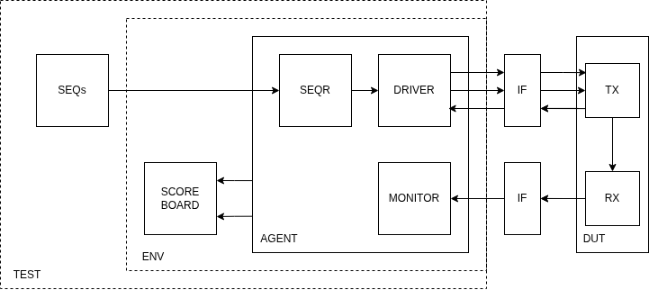

# Universal UART Verification Environment (UVM)


A robust, parameterizable **UVM 1.2** verification environment designed to validate a full-duplex UART controller. This project demonstrates the application of **Constrained Random Verification (CRV)** and **Scoreboarding** to ensure data integrity across multiple baud rates.

---

## 🏗️ Architecture & Design

The environment verifies a cross-connected UART RX/TX pair (based on the [Nandland](https://nandland.com/uart-serial-port-module/) architecture). It utilizes a high-level UVM testbench to drive stimuli and monitor responses through a SystemVerilog Interface.

<div align="center">
  
  <br>
  <b>Figure 1: UVM Testbench Hierarchy and RTL Connectivity</b>
</div>

### **Core Components:**
* **Parameterized Top:** Allows for dynamic baud rate switching via `CLKS_PER_BIT`.
* **Stress Sequence:** Implements a weighted distribution to simulate real-world bus conditions:
    * **70% Burst Mode:** Consecutive transfers with zero delay.
    * **20% Random Jitter:** Short idle periods (1-20 cycles) between bytes.
    * **10% Hold State:** Extended idle periods to test synchronization recovery.
* **Self-Checking Scoreboard:** Automated packet comparison between TX and RX streams.

---

## 📊 Regression Results

The following table summarizes the verified stability across common industrial baud rates. All tests were executed using **Siemens Questa FPGA Starter Edition**.

| Test Case | Baud Rate | Clks/Bit (at 100MHz) | Status |
| :--- | :--- | :--- | :--- |
| `test_9600` | 9,600 | 10417 | ✅ PASSED |
| `test_19200` | 19,200 | 5208 | ✅ PASSED |
| `test_57600` | 57,600 | 1736 | ✅ PASSED |
| `test_115200` | 115,200 | 868 | ✅ PASSED |

### **Log Summary**
```text
# --- UVM Report Summary ---
# UVM_INFO :  306
# UVM_WARNING :    0
# UVM_ERROR :    0
# UVM_FATAL :    0
```


## 📂 File Structure
```bash
.
├── rtl/        # UART RX/TX and Top-level wrapper
├── tb/         # UVM Testbench 
│   ├── top/    # TB Top and SystemVerilog Interfaces
│   └── uvm/    # UVM Package and Components (Agents, Env, etc.)
├── sim/        # Simulation logs and Makefile
└── docs/       # Architecture diagrams and specifications
```

---

## 🚀 Execution Guide

### **Environment Setup**
The simulation is optimized for **Siemens Questa FPGA Starter Edition**. Ensure your environment variables for `vsim` and `vlog` are correctly mapped to your simulator path.

### **Running Tests**
All simulation control is handled via the provided `Makefile` within the `sim/` directory.

1.  **Initialize and Compile:**
    ```bash
    make compile
    ```
    *Creates the `work` library and compiles both RTL and UVM source files.*

2.  **Run Standard Test (115200 Baud):**
    ```bash
    make run
    ```

3.  **Execute Full Regression:**
    ```bash
    make regression
    ```
    *Sequentially runs tests for 9600, 19200, 57600, and 115200 baud rates and greps for the "PASS" status.*

### **Makefile Commands Overview**
| Command | Action |
| :--- | :--- |
| `make gui` | Launches Questa GUI for signal tracing and waveform analysis. |
| `make clean` | Cleans the directory of `vsim.wlf`, `transcript`, and all `.log` files. |
| `make test_[baud]` | Runs specific baud rate targets (e.g., `make test_9600`). |
| `make regression` | Runs all baud rate targets. |

---

## 🛠️ Toolchain & Methodology

* **Simulator:** 
* **Standard:** 
* **Design:** 
* **Automation:** 

---

## 👨‍💻 Author
**Yusuf Tekin** *Digital Design & Verification Engineer* [LinkedIn](https://www.linkedin.com/in/yusuf-tekin-497960237/) | [GitHub](https://github.com/jsphtkn)

---

## 📝 License
This project is licensed under the MIT License - see the [LICENSE](LICENSE) file for details.